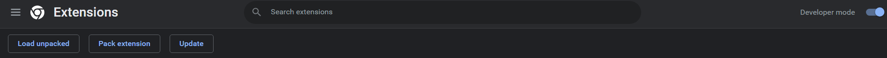
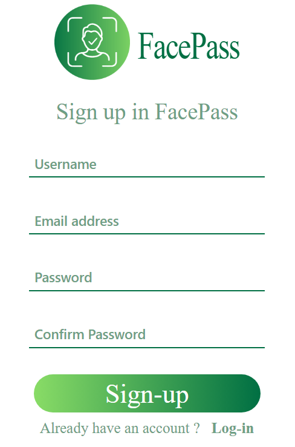

# FACEPASS_project

## Description

FacePass is a Chrome extension that works as a middle gateway to lock/unlock websites with your face using Ai based technologies such as (face recognition and liveness detection) to verify the identity of the user. It aims to provide more privacy in shared devices so that no one can access your personal websites or use your data except you.

## Table of Contents

- [Motivation](#motivation)
- [Tecnologies](#tecnologies)
- [Installation](#installation)
- [Challenges](#challenges)
- [Credits](#credits)

## Motivation

The problem we saw is that if you try to log into any website on the web you have two ways either the traditional way that you'll log in manually, by writing your password and email, then log in to the site. or you let Chrome save your password and email then it auto-fills your data in future logins.

In the first way (the traditional way) you have to write your email and password each time you log in to the site, and also you have to remember all the passwords for each site you have an account on. And we all know that we shouldn't use 1 password for all our sites (hackers will be very glad when you do this).

In the second way, you only log in once, and then Chrome saves your password and email so you don't have to remember them and write them again. but it also has a disadvantage, if anyone uses your device after you or if the device is shared between more than one person then you have no privacy at all. The other person can easily use your saved accounts and access your data.

So we came up with the idea of **FacePass** to provide a solution to this by locking your personal sites with your face to provide more privacy along with saving your passwords in the browser.

## Tecnologies

- HTML 5 / CSS 3
- JavaScript
- Python
- Flask


## Installation

For now, we haven't fully uploaded the extension on the store due to [the challenges](#challenges) we faced, but it works locally. If you want to try it, please follow these steps :

1. Clone or download the repository to your device

2. Install the required packages for the AI models to run in the `requirments.txt` file in the model folder. You can do this by changing the directory to `FACEPASS_project\Model\` and using the following command :

```
pip install -r requirements.txt
```

**_Note:_** The **dlib** package may make a problem when installing, the following link may help: https://github.com/datamagic2020/Install-dlib

3. Activate the developer mode on the browser and load the extension folder with `load unpacked`
   

4. **After installation you are free to use and test the extension yourself**
<div>
  
</div>

## Challenges

- We faced a problem with the `dlib` library when we tried to upload the server-side code and the model to a remote server
- we couldn't find a way to discover and disable the log-in form on websites automatically so that users can specify the sites that they want to be locked. currently, we activated the extension on 3 sites (Facebook, GitHub, and Udemy)

## Credits

Thanks to my collaborators:

- [Mohamed Abdelkarem](https://github.com/Mohamed-Abdelkarem)
- [Ghada Hussein](https://github.com/ghada29)
- [Yasmen Khaled](https://github.com/YasmenKhaled)
- [Lobna Badr](https://github.com/lobnabadr)
